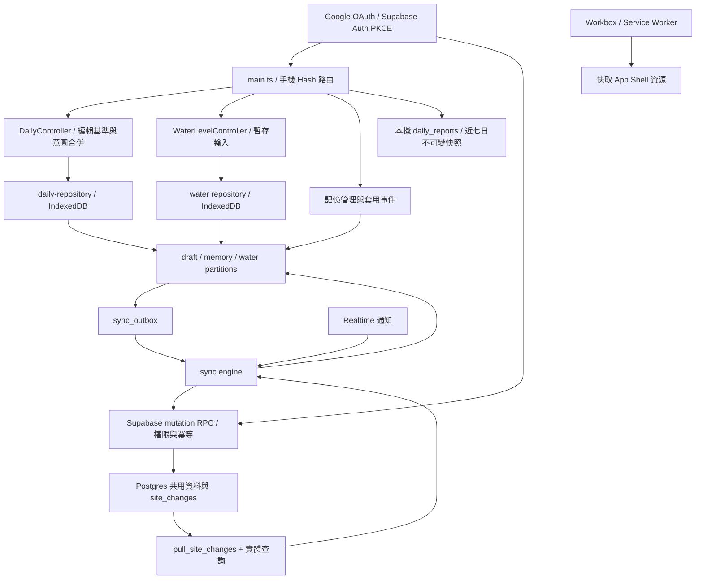

# 全專案審計與修復交接報告

日期：2026-10-04（Asia/Taipei）  
專案：`D:\app\APP_TEST\daily-report-web`  
審計基準：`6c4cc983b4e8f63b7a1b15f0cd66943f5add2ca6`  
目的：讓接手模型依據證據修復；本次沒有修改應用程式、SQL、套件或 CI，沒有 commit、push、部署或操作正式資料。

## 1. Executive Summary

**目前適合繼續開發與隔離測試，尚不足以宣稱多人協作及資料復原可靠。** 本機資料模型、欄位 mutation、同步 outbox、工地分區與 PWA 邊界已存在；主要風險集中在不同層之間的契約不一致。

- 最大安全風險：遠端資料進入 HTML 屬性時未完整跳脫，以及 RPC 未限制巢狀識別與資料結構，形成儲存型 XSS 路徑（F02）。
- 最大資料風險：IndexedDB 舊版 migration 實際不執行（F01）；衝突重試被誤認成功（F04）；刪除後復原無法通過伺服器 tombstone（F05）。
- 最大架構風險：`live_report_draft`、partition、controller 與 outbox 存在多條不同的寫入路徑；水位的衍生值、保留期限與編輯草稿尚未明確分工（F06–F08、F11）。
- 最大維護負擔：大型 `main.ts` 同時處理 UI、同步、工地切換與學習提交；Git 追蹤 10,732 個 `node_modules` 檔案（F18）。不建議先全面重寫。
- 共 20 項 finding：**P0 0、P1 8、P2 11、P3 1、P4 0**。這是不同根因的修復工作包，不代表 20 個均已在正式環境發生。

### 驗證結果與界線

| 檢查 | 結果 | 可以支持的結論 |
|---|---|---|
| `npm test` | 41 檔；184 通過、1 失敗 | 現有測試不全綠；F15 阻擋目前 CI 測試閘門 |
| 單獨重跑失敗檔 | 同一 formatter 基準失敗 | 不是其他測試順序造成的偶發失敗 |
| `npx tsc -p tsconfig.json --noEmit` | 通過 | TypeScript 靜態檢查通過；不等於 JS、水位、SQL 或 UI 行為通過 |
| 標準 `npm run build` | TypeScript 通過，Vite 遇 `realpath ... index.html: EPERM` | 此受限 Windows 環境的建置限制，不能推論 Linux CI 也失敗 |
| 單次 `preserveSymlinks: true` 建置 | 通過，含 PWA injectManifest | 替代建置成立；沒有永久修改 Vite 設定，也未部署 |
| 隔離探針 | 13 組本機觀察、2 組模擬 RPC／IndexedDB 觀察 | 直接載入現有模組；結果見交接附件；不是正式 Supabase 測試 |
| `npm audit --json` | 5 個套件項：3 high、2 moderate，均屬 dev dependency | 套件公告命中；不能換算成 5 個正式站可利用漏洞 |
| 真實 Postgres／RLS／雙連線並行 | 未執行 | SQL findings 為明確程式證據及時序推導，另列必要驗收 |
| 真實手機、瀏覽器 DOM 攻擊、OAuth、PWA 更新、雙帳號 | 未執行 | 不宣稱 UI、攻擊成功、雲端資料或裝置驗收通過 |

證據資料夾：`artifacts/full-audit-2026-10-04/`。探針只使用 `fake-indexeddb` 的記憶體資料庫，沒有讀寫使用者瀏覽器資料。

### 範圍與覆蓋方式

全 repository 先盤點，再追查第一方執行路徑。已涵蓋入口、領域／formatter、日報 repository、所有同步模組、記憶與水位分區、Auth、遠端 repository、所有 migration 的有效定義、修復 SQL 的角色、測試結構、設定、腳本與 Pages workflow。UI/CSS 採結構及關鍵互動檢查；文件比對目前規格與歷史 ADR；生成圖、圖片、ZIP、歷史 bundle 只做資產盤點。**未逐行人工審閱第三方套件、每份歷史文件與每個 CSS 宣告，也未把資產盤點宣稱為視覺驗證。**

專案未追蹤 `AGENTS.md` 或 `CLAUDE.md`；本次遵循使用者訊息中的 AGENTS 指示。未找到第一方 Dockerfile、獨立 API server 或既有 `supabase/config.toml`。Supabase 初始化步驟見其 README；不能因沒有 Dockerfile 就要求加入服務容器。忽略及環境設定僅以設定契約檢查，不將秘密值放入報告。

## 2. Architecture Map

### 目的、使用者流程與邊界

現場人員以手機建立施工、材料、聯絡與特殊事項，儲存草稿、預覽及定稿複製；水位另有井位、量測、變化計算與近三天檢視。離線可使用；Google 登入後選擇已取得成員資格的工地，共用草稿、水位與記憶。**定稿快照是本機近七日歷史，雲端草稿不是定稿備份。**



### 技術與資料所有權

| 區域 | 目前實作／主要檔案 | 邊界及風險 |
|---|---|---|
| Frontend | Vite、TypeScript、原生 DOM；`src/main.ts`、`src/daily/*` | 沒有 React／獨立 backend process；不要新增無需求框架 |
| 本機資料庫 | `src/data/db.js`，DB version 17 | 唯一 opener；所有 store 以 id 為 key，沒有查詢用 index |
| 日報 | `DailyReportV3`、`daily-controller.ts`、`daily-repository.ts` | 草稿分區＋編輯 baseline＋欄位 diff；歷史另存 |
| 暫存輸入 | `entry-workflow.ts`、`main.ts:704–718` | 聯絡與工項未提交文字存 localStorage；材料／水位不完全相同 |
| 記憶 | `memory-partition.ts`、`memory-applications.ts` | 父子項逐筆同步；套用事件去重，4 次自動確認 |
| 水位 | `water-level/*`、`water-partition.ts` | 日誌、井位、衍生變化量混合保存，需修正 F06–F08 |
| 登入 | `auth-service.ts`、`supabase-client.ts` | PKCE callback 明確交換 code；publishable key 在前端屬預期 |
| 授權 | `site_members`、`site_role`、`can_edit_site` | viewer 讀取、editor/owner 寫入；RPC 檢查角色，RLS 管讀取 |
| 同步 | `engine.ts`、`field-mutations.ts`、`outbox.ts` | 先拉再推，成功後再拉；手動＋30 秒背景與 Realtime 觸發 |
| 相容性／復原 | `recovery.ts`、`conflict-review.ts`、legacy RPC | 勿直接刪舊操作；新舊協定都可能仍有離線佇列 |
| 部署 | `.github/workflows/deploy.yml` | main push → npm ci → test → build → Pages；SQL 另外部署 |
| PWA | `src/service-worker.ts`、`vite.config.ts` | Workbox precache、prompt update；不快取日報 API 回應 |

### API 契約摘要

| 呼叫 | 輸入／用途 | 必須保留的契約 |
|---|---|---|
| `create_site` / `request_join` / `approve_site_member` | 建立、申請與核准成員 | 所有授權在 SQL；不得只依 UI 隱藏按鈕 |
| `apply_daily_field_mutation` | site、mutation、entity、report date、changes | 工地＋日期定位、穩定 ID、可重送；修 F03–F05 |
| `apply_water_field_mutation` | site、mutation、changes | 井位／量測／reading 的穩定 ID；衍生值與保留政策分離 |
| `apply_memory_entry_mutation` | site、mutation、base revision、entry | 管理編輯 CAS；父項同工地，名稱自然鍵去重 |
| `apply_memory_application` | 上述＋`learning_key`、delta | 每個有效套用事件只累加一次；目前有 site advisory lock |
| `pull_site_changes` | site、cursor、limit | 回傳事件索引，客戶端再取 payload；不是完整 payload feed |

SQL 使用 definer RPC 並有 `auth.uid()`／角色檢查及對 PUBLIC 的 revoke。未發現可以僅憑任意 site ID 直接讀寫其他工地的已確認路徑；這不等於 RLS 行為已驗證。[Supabase RLS 說明](https://supabase.com/docs/guides/database/postgres/row-level-security)指出 grants 與 policies 必須一併驗證。

## 3. Findings Summary

以下位置皆相對於本報告開頭的 repository root；行號對應上述 commit，不是舊報告的行號。D＝隔離動態重現；S＝原始碼與呼叫／SQL 路徑交叉確認；C＝命令結果。SQL 未在實際 DB 執行者會另外註明。

| ID | Severity | Category | Issue | Location | Effort | Confidence |
|---|---|---|---|---|---|---|
| F01 | P1 | Data / Migration | oldVersion 取錯物件，舊資料遷移不執行 | data/db.js:7–24 | M | High D |
| F02 | P1 | Security | 雲端名稱／巢狀 ID 可注入 HTML 屬性或標籤 | account/account-view.ts:26–33；water-level/controller.js:67 | M | High D+S |
| F03 | P1 | Concurrency | 首次建立共編文件會覆蓋並行修改 | 202609230001 SQL:63–94 | M | High S |
| F04 | P1 | API / Data loss | 重送衝突回傳 duplicate，前端誤刪操作 | 20260930040002 SQL:43；sync/engine.ts:414–416 | M | High D+S |
| F05 | P1 | Product / Sync | 復原沿用已刪 ID，被 tombstone 靜默忽略 | daily-controller.ts:56–63；202609230001 SQL:66–68 | M | High D+S |
| F06 | P1 | State / Data loss | 水位刷新／重建 controller 清掉未儲存輸入 | water-level/controller.js:34–39；main.ts:633 | M | High D+S |
| F07 | P1 | Data / Retention | 本機三日清理被轉成共用永久刪除 | water-level/repository.js:10–12；water-partition.ts:35–36 | M | High D+S |
| F12 | P1 | Authorization lifecycle | 舊核准申請可改寫現有 owner，繞過最後管理員保護 | 202609210001 SQL:90–101 | M | High S |
| F08 | P2 | Correctness | 水位 change 不同步也不在接收端重算 | field-mutations.ts:12；engine.ts:309–339 | S | High D+S |
| F09 | P2 | Error handling | 新增／刪除差異的 undefined 令衝突頁崩潰 | account/account-view.ts:49–50 | XS | High D |
| F10 | P2 | Recovery | 解決衝突後刪原文，沒有自動處理前備份 | conflict-review.ts:136–153；engine.ts:115–119 | S | High D+S |
| F11 | P2 | State consistency | 主檔改名只更新 live store，重載仍讀舊 partition | daily-repository.ts:58–69、154–160 | M | High D+S |
| F13 | P2 | Validation | 大於零但小於一的材料數量被拒絕 | daily-validator.ts:7；main.ts:684 | S | High D |
| F14 | P2 | Import / Validation | 貼上匯入繞过量測驗證，接受錯誤數字 | water-level/parser.js:1；controller.js:102–120 | S | High D+S |
| F15 | P2 | CI / Contract | formatter 與固定基準不一致，測試閘門失敗 | daily-redesign-baseline.test.ts:18；fixture:95 | S | High C |
| F16 | P2 | Testing / Operations | DB 測試只有結構；CI 不驗 SQL/RLS 行為 | supabase/tests/001_rls_contract.sql:3–24 | M | High S |
| F17 | P2 | Performance | 每個 change 串行再取完整文件，重複傳输 | sync/engine.ts:344–379 | M | High S |
| F18 | P2 | DX / Repository | node_modules 被 Git 追蹤，含測試快取 | .gitignore:1；node_modules/.vite/vitest/*/results.json:1 | S | High C |
| F19 | P2 | Product / Documentation | README、ADR、PRODUCT 對同步／學習／定稿互相矛盾 | README:20、34；ADR-011:5–32 | S | High S |
| F20 | P3 | Dependencies | 開發工具鏈有已知安全公告命中 | package-lock.json:2741、3026、3701、4758、6107 | S–M | High C |

Effort：XS 約 1 小時內；S 半天內；M 1–3 工程日。均為含回歸測試的粗估，不含部署等待、產品決策及既有資料修復成本。

## 4. Detailed Findings

### [F01] IndexedDB 舊版 migration 沒有執行

- **Severity / Category / Effort / Confidence**：P1 / Database、資料完整性 / M / High。
- **Evidence**：`src/data/db.js:7–24`，`openDatabase()`。
- **Problem**：讀取 `request.oldVersion`，但 oldVersion 屬於 `onupgradeneeded` 的事件。`undefined < 2/8/9` 均為 false，所有依版本條件的資料搬移／補欄位被跳過。
- **Trigger / Why it matters**：既有使用者由舊版升級。store 建立與版本升到 17 仍成功，但舊資料沒有進入新讀取路徑；使用者會看到資料不見，之後相同版本也不會再觸發 migration。
- **Verification / reasoning**：探針 `migration` 建立 v1 的 reports，再呼叫現有 opener。結果 legacy=1、migrated=0，metadata 為 `schema-undefined-to-17`。這不是資料被刪除，而是升級與讀取失配。[MDN oldVersion](https://developer.mozilla.org/en-US/docs/Web/API/IDBVersionChangeEvent/oldVersion)。
- **Recommended fix**：改用事件 oldVersion；針對**已升至 17** 的安裝另設可重入 repair migration／提高版本。先備份，再檢查舊 `Draft.report` 包裝與新 `DailyReportV3` 的形狀；不可只把物件 spread 過去當作完成轉換。
- **Acceptance**：v1、v7、v8、v17 fixture 升級後草稿／歷史可讀、數量與內容核對、重跑不重複；migration 中途 abort 保留原資料。

### [F02] 遠端資料跨越 HTML 信任邊界，形成儲存型 XSS 路徑

- **Severity / Category / Effort / Confidence**：P1 / Security / M / High；未做真實瀏覽器執行驗證。
- **Evidence**：`src/account/account-view.ts:26–33`（escapeHtml、siteRows）；`src/water-level/controller.js:67、83`（historyView、pointsView）；`src/sync/engine.ts:334–336`；`supabase/migrations/202609230001_field_collaboration.sql:17–49、79–94`。
- **Problem**：帳號頁 escapeHtml 不跳脫雙引號，卻把工地名稱插入雙引號包住的 aria-label。水位及其他 UI 把巢狀 `id` 直接插入 HTML。SQL 只確認 changes 是 array，沒有 UUID／欄位白名單／值型別校驗，JSON 內的 id 不受表上 UUID 主鍵型別保護。
- **Trigger / Why it matters**：工地 owner 提供特殊名稱，或有寫權的成員以 RPC 提供特殊水位 ID；其他成員拉取後顯示對應頁面。可在應用程式 origin 插入事件屬性／標籤，危及該成員本機資料與登入 session。沒有聲稱匿名者可寫入。
- **Verification / reasoning**：`account-name-attribute` 與 `water-id-html` 都確認輸出字串包含注入屬性／img 標籤；已追查 RPC → remote payload → IndexedDB → innerHTML。只用了無外傳的 marker，未操作正式站。[MDN innerHTML 安全說明](https://developer.mozilla.org/en-US/docs/Web/API/Element/innerHTML)。
- **Recommended fix**：動態文字／dataset 使用 DOM API，或統一完整屬性跳脫；所有遠端、備份與 localStorage 輸入做 runtime schema 驗證。SQL 白名單限制 collection/op/field、ID、形狀及大小；不允許直接 set 文件 date/id 等識別欄位。對既有異常 payload 隔離並提供復原，不直接毀棄。
- **Acceptance**：引號、尖括號、事件屬性、錯誤 ID、錯誤 collection 與非預期欄位都不能產生額外 DOM 或寫入非法資料；owner/editor/viewer 行為矩陣測試通過。

### [F03] 首次建立日報或水位文件時，並行 patch 會互相覆蓋

- **Severity / Category / Effort / Confidence**：P1 / Concurrency / M / High（SQL 靜態時序確認；DB 並行驗收未執行）。
- **Evidence**：`supabase/migrations/202609230001_field_collaboration.sql:63–72、87–94`，兩個 field mutation RPC。
- **Problem**：先 `SELECT ... FOR UPDATE`，在找不到列時從空 payload 計算，最後 UPSERT 的 conflict 分支把 `excluded.payload` 整份覆蓋。
- **Trigger / Why it matters**：A、B 同時首次建立相同工地／日期，或第一份 water snapshot。兩個 SELECT 都查不到列，各自得到不同 payload；後者 conflict update 將前者內容消除，兩次卻都回 applied。
- **Verification / reasoning**：後續 migrations 未重定義此函式；記憶 application 有 advisory lock，日報／水位沒有。FOR UPDATE 鎖的是查到的列，不能保護不存在的列。[PostgreSQL 鎖定文件](https://www.postgresql.org/docs/current/explicit-locking.html)。
- **Recommended fix**：先取得文件層 transaction advisory lock，再做冪等判斷與 read-modify-write；或先插入空文件、再鎖列讀取。統一所有相容 RPC 的鎖順序，避免新舊協定繞過。
- **Acceptance**：兩連線以 barrier 同時首次寫入不同 ID／不同欄位，最終都保留；同 mutation 併發重送只產生一次 change。不可用循序單元測試代替。

### [F04] 衝突回應遺失後重送，被當成成功並清掉本機操作

- **Severity / Category / Effort / Confidence**：P1 / API、資料遺失 / M / High。
- **Evidence**：`supabase/migrations/20260930040002_memory_application_workflow.sql:39–43、59–69、115–116`；`202609210003_daily_sync_rpc.sql:28–41`；`src/sync/engine.ts:115–119、414–416`。
- **Problem**：SQL 會保存 conflict result，重送相同 mutation 時卻無條件把 result.status 改為 duplicate；engine 只對 conflict 保留操作，其他狀態一律 accept 並刪除。
- **Trigger / Why it matters**：伺服器已記錄衝突，但 HTTP 回應遺失／頁面中斷；客戶端以原 mutation 重試。實際沒有寫入成功，本機原始意圖卻被清除，摘要顯示已送出。
- **Verification / reasoning**：`reproduce-sync.mjs` 以符合 SQL 實作的重送回應餵給真正 `runSyncOnce()`；applied=1、conflicts=0、outbox=[]、backups=[]。網路遺失與 SQL 實際執行仍需整合驗收。
- **Recommended fix**：冪等重送回傳原始 outcome，另加 replayed 標記；或明確 `duplicate_of_status`。前端只確認「已套用」結果，conflict 必須繼續保留原 payload。相容部署期間既有 duplicate 格式。
- **Acceptance**：注入「DB 已 commit conflict、HTTP 回應丟失」後重試，仍顯示衝突且原操作／備份完整；applied 重送仍只計一次寫入。

### [F05] 刪除後復原保留舊 ID，與伺服器 tombstone 不相容

- **Severity / Category / Effort / Confidence**：P1 / Product、Sync / M / High。
- **Evidence**：`src/daily/daily-controller.ts:54–64`（restoreDeletedItem、removeWorkItemForUndo）及 `restoreDeletedTrade():72`；`src/daily/work-gestures.ts:28–32`；`202609230001_field_collaboration.sql:66–68`。
- **Problem**：UI 復原原物件及原 ID；伺服器一旦記錄刪除，對同 ID 的 upsert/set 永久 continue，仍回整批 applied。
- **Trigger / Why it matters**：刪除已保存／排入 outbox，再按復原；即使同一輪依序送 delete/upsert，也會在伺服器忽略復原。畫面暫時出現，下一次拉取又消失。
- **Verification / reasoning**：`undo-identities` 顯示 delete 和 restore upsert 使用完全相同的 work ID、parent ID。已檢查 server tombstone 與本機只在單次 apply 中保存 deleted set 的差異。
- **Recommended fix**：未送達且可證明未嘗試的刪除，可原子取消對應操作；已送達或狀態不明的復原以新 ID 重建，連帶更新父子及進料連結。另一方案為有版本條件的明確 restore 協定，不能全面關閉 tombstone。
- **Acceptance**：離線刪除復原、同步中復原、另一台先看見刪除後復原，最後雙方皆可見恢復內容，舊離線 patch 仍不能自行復活項目。

### [F06] 背景水位刷新與 UI 重建會丟失未儲存輸入

- **Severity / Category / Effort / Confidence**：P1 / State、資料遺失 / M / High。
- **Evidence**：`src/water-level/controller.js:33–44`，`refresh()`；`src/main.ts:495–505、633、1344、1391`。
- **Problem**：新增量測尚無 id，refresh 直接 `newLog()`；主 render 又會把 water 設成 undefined 並重新建立 controller。僅復原焦點沒有復原欄位值。
- **Trigger / Why it matters**：輸入電量／讀值時收到他人的水位變更，或某個動作引發整頁 render；使用者未按取消，資料已消失。
- **Verification / reasoning**：`water-refresh`：輸入 battery=2.798，呼叫現有 refresh 後變空字串；background sync 的 waterPulled 分支確實會呼叫它。
- **Recommended fix**：讓 water editor 成為依 scope 分區的獨立 draft，refresh 只更新遠端清單及讀取模型；dirty/new editor 不得重置。重建 DOM 不重建草稿生命週期；切工地／日期有明確處置。
- **Acceptance**：焦點中／離焦、遠端更新、手動同步、切頁回來、失敗重試都保留未儲存數值；提交成功或明確取消才清空。

### [F07] 三天保留清理被當成全工地刪除

- **Severity / Category / Effort / Confidence**：P1 / Database、Retention / M / High。
- **Evidence**：`src/water-level/repository.js:7、10–12`（loadLogs/saveLog/prune）；`src/data/water-partition.ts:24–36`；`src/sync/field-mutations.ts:34`；`CONTEXT.md` 的共編文件規則。
- **Problem**：saveLog 先用三天內資料 replaceRecords，再 prune；persist 對比舊 partition，把不在本機的舊 log 轉成 delete mutation。舊快照即使被重新拉回，下次儲存仍會產生刪除。
- **Trigger / Why it matters**：有超過三天的共用量測，任一裝置儲存新量測；其他裝置也會收到刪除，並產生 tombstone。本機顯示期限意外變成雲端保留期限。
- **Verification / reasoning**：`water-prune-diff` 重現舊 log 消失即產生 delete；呼叫鏈與產品「本機清理不當成共用刪除」要求交叉確認。
- **Recommended fix**：顯示 filter 與同步基底分離；只有明確刪除指令可以寫入 outbox。若需雲端保留政策，由 server 排程、備份與明確規格處理，不能由任意手機時鐘決定。
- **Acceptance**：跨日、快慢時鐘、離線重連後，顯示仍為近三日但沒有因 prune 產生 delete；使用者明確刪除才傳播。

### [F12] 重播舊核准申請可繞過最後 owner 保護

- **Severity / Category / Effort / Confidence**：P1 / Authorization lifecycle / M / High（SQL 路徑確認，未執行 DB）。
- **Evidence**：`supabase/migrations/202609210001_shared_sites.sql:90–101`，`approve_site_member()`；`202609210004_member_management.sql:15–43`。
- **Problem**：核准函式不檢查申請必須 pending；on conflict 直接更新現有 member.role。這條路徑沒有 update/remove RPC 的最後 owner 防護。
- **Trigger / Why it matters**：B 由申請加入，之後升成 owner，A 退出後 B 成為唯一 owner；B（或有其 session 的呼叫者）重送 B 的舊 request ID，以 editor 核准，檢查當下仍是 owner，隨即把自己降為 editor，工地再無管理者。舊申請也可意外恢復已撤銷資格。
- **Verification / reasoning**：交叉確認申請列持續存在、approval 不檢查 status、role 更新另有 last-owner guard。不是宣稱 viewer 能任意升權。
- **Recommended fix**：核准只接受 pending、對已處理申請採明確冪等結果，不改現有 member；所有 owner 增減在相同工地鎖內驗證至少一位 owner。
- **Acceptance**：重播 approved/rejected request、成員已存在、唯一 owner、兩 owner 同時離開／降權，都不會使工地失去管理者。

### [F08] 水位衍生變化量在同步後不正確

- **Severity / Category / Effort / Confidence**：P2 / Correctness / S / High。
- **Evidence**：`src/sync/field-mutations.ts:12、29`；`src/sync/engine.ts:309–339`；`src/water-level/calculator.js:5`；`src/water-level/formatter.js:3`。
- **Problem**：diff 忽略 change；既有 reading 的 value 更新後，雲端／接收端沒有 recalculate，formatter 卻仍讀保存的 change。另把 value 清空時，recalculate 保留舊 change。
- **Trigger / Why it matters**：原本 10→11 變化=1，把前筆改 9，本機變化=2，遠端仍可顯示 1；監測輸出數字不一致。
- **Verification / reasoning**：`water-derived-sync` 實測 localChange=2、remoteReplayChange=1；`water-empty-reading` 為 value=""、change=1。
- **Recommended fix**：change 設為讀取時由同一 canonical calculator 推導的值；若保留來源文字中的 change，另設 sourceChange，不能與計算結果混用。缺值與沒有前筆的規則要明確。
- **Acceptance**：改舊量測、刪前筆、清空讀值、收到遠端 patch 後，各端預覽／複製相同且缺值不殘留舊變化。

### [F09] 新增或刪除衝突差異會令帳號頁 renderer 丟例外

- **Severity / Category / Effort / Confidence**：P2 / Error handling / XS / High。
- **Evidence**：`src/sync/conflict-review.ts:17–27`，`diffConflict()`；`src/account/account-view.ts:26、49–50`，`printable()`。
- **Problem**：新增／刪除的其中一側是 undefined；JSON.stringify(undefined) 仍是 undefined，傳入 escapeHtml 後 `.replace()` 失敗。
- **Trigger / Why it matters**：衝突中新增或移除一個欄位／項目，就可能無法顯示修復入口。
- **Verification / reasoning**：`conflict-missing-value` 直接使用現有 diffConflict＋renderAccountPage，得到 `Cannot read properties of undefined (reading 'replace')`。
- **Recommended fix**：printable 明確呈現「不存在」與 null 的差異，再進行跳脫；不要將 undefined 靜默變成空物件。
- **Acceptance**：新增、刪除、null、空字串、巢狀陣列差異均可 render；備份與確認按鈕仍可使用。

### [F10] 一般衝突解決成功後，原始本機內容未自動備份

- **Severity / Category / Effort / Confidence**：P2 / Recovery / S / High。
- **Evidence**：`src/sync/conflict-review.ts:136–153`（queueConflictResolution）；`src/sync/engine.ts:75–80、115–119`（acceptMutation）；`exportConflictBackups():92–105`。
- **Problem**：排入替代操作時沒有寫 sync_recovery_backups，成功後刪原 outbox/conflict。下載備份按鈕屬可選操作，不能取代系統保證。
- **Trigger / Why it matters**：使用者採用雲端版本後發現選錯；操作成功即失去本機原文。與 CONTEXT 的「衝突處理前備份」契約不符。
- **Verification / reasoning**：`resolution-discards-original` 以現有 engine 確認成功後 outbox/conflicts/backups 都空。另一路 `applySyncRecovery()` 有備份，**不可誤認它涵蓋一般 queueConflictResolution**。
- **Recommended fix**：建立 resolution operation 時，在同一交易永久保存 source operation、舊 conflict、reviewed cloud revision/payload 與選項；確認成功僅移除活動佇列。
- **Acceptance**：全部採雲端、部分採本機、重試、中斷、後續成功，都可匯出當時未合併的雙方原文。

### [F11] 主檔更名只改 live store，與 partition／controller 分歧

- **Severity / Category / Effort / Confidence**：P2 / State consistency / M / High。
- **Evidence**：`src/data/daily-repository.ts:58–69、154–160、177`；`src/main.ts:1313` 的設定 submit。
- **Problem**：saveMemory 的 syncRename 只寫 live_report_draft；loadDailyDraft 優先讀 draft_partitions；設定 submit 未將更新後草稿納入 controller/partition/outbox 的正常保存路徑。
- **Trigger / Why it matters**：日報已保存後，在設定更改使用中的工種／廠商／工項，重新載入仍回舊草稿名稱，或下一次 controller.flush 再覆寫 live store。主檔與草稿行為不一致。
- **Verification / reasoning**：`rename-partition`：live="new"、reloaded="old"。材料／聯絡一般儲存後有 daily.flush，不能把它們一概列成相同缺陷。
- **Recommended fix**：先決定更名是否影響當日草稿；若要影響，所有修改走共用 draft transaction＋意圖合併；若只影響未來使用，移除對 live draft 的局部回寫。定稿快照不修改。
- **Acceptance**：主檔、controller、live、partition、outbox 在指定規格下相符；重載／切工地／下一次儲存不回退。

### [F13] 材料數量 0.5 被錯判無效

- **Severity / Category / Effort / Confidence**：P2 / Validation、Product / S / High。
- **Evidence**：`src/daily/daily-validator.ts:7`、`src/main.ts:684`，兩套數量 regex。
- **Problem**：規格文字說大於 0，regex 卻要求整數部分首位 1–9，拒絕 0.5、0.25 等有效重量／體積。
- **Trigger / Why it matters**：輸入不足一噸或一方的材料，無法儲存或定稿。
- **Verification / reasoning**：`quantity-half` 回傳「數量只能輸入大於 0 的數字」。兩處同樣錯誤，不能只修 UI 或只修定稿 validator。
- **Recommended fix**：建立共同 decimal validator；明訂空白、負值、0、NaN、Infinity、科學記號與精度政策。保留 quantity 字串格式，避免不必要 schema 改動。
- **Acceptance**：0.1、0.5、1、1.25 通過；0、負數、不合法數字失敗；儲存與定稿結果一致。

### [F14] 水位文字匯入繞過表單驗證

- **Severity / Category / Effort / Confidence**：P2 / Input validation / S / High。
- **Evidence**：`src/water-level/parser.js:1`；`src/water-level/controller.js:102–120`，`importText()`；`repository.js:10`。
- **Problem**：parser 的 `[\d.]+` 接受 1.2.3，電池任意字串也接受；importText 直接 saveLog，未經 validateLog。無效或過期日期亦未在寫入前核對。
- **Trigger / Why it matters**：貼上誤植資料，可能存入 NaN／非法文字；過期紀錄被 prune 後，畫面卻回報已匯入。部分井位也可能在 log 驗證前已建立。
- **Verification / reasoning**：`water-invalid-import` 得到 ok=true、value="1.2.3"、battery="invalid"；已對照手動 save-log 有 validateLog、匯入沒有。
- **Recommended fix**：parser 只解析；匯入寫入前使用同一 domain validator，驗證整個 segment 後才建立井位／log；回報新增、覆蓋、略過與失敗的真實結果，避免半套匯入。
- **Acceptance**：錯誤小數、非法日期、過期時間、重複時點、多段中部分失敗，都不會寫入不合法值或錯報成功。

### [F15] 現有測試失敗，CI 發布閘門無法通過

- **Severity / Category / Effort / Confidence**：P2 / CI、Output contract / S / High。
- **Evidence**：`tests/unit/daily-redesign-baseline.test.ts:18`；`tests/fixtures/populated-daily-report.ts:95`；`src/daily/daily-formatter.ts:10、16`；`.github/workflows/deploy.yml:27`。
- **Problem**：基準期待 `鋼筋工程－萬大禾鋼鐵：…`；目前輸出是 `1.鋼筋工程-萬大禾鋼鐵…`。現有驗收資料與 formatter 已分歧。
- **Trigger / Why it matters**：每次 npm test／main 部署都會遇到；不應把舊報告的 177／158 通過當成本次全綠。
- **Verification / reasoning**：全套 185 項有 1 失敗；單獨重跑相同失敗，見 `failing-test.log`。
- **Recommended fix**：依最新核准的輸出規格決定 formatter 或 fixture 哪個需改，再同步相關測試與文件；不得只為變綠刪測試／盲目更新 snapshot。
- **Acceptance**：最新正式範例逐字確認，全部測試通過，現有同日／排程聯絡事項語意保留。

### [F16] 資料庫測試未驗證實際權限與並行行為，CI 不執行 SQL

- **Severity / Category / Effort / Confidence**：P2 / Testing、DevOps / M / High。
- **Evidence**：`supabase/tests/001_rls_contract.sql:3–24`；`.github/workflows/deploy.yml:21–36`；`vite.config.ts:36`。
- **Problem**：pgTAP 只有 18 項表、policy 名稱、函式權限斷言；沒有 impersonate 角色的資料讀寫。Vitest 使用 node environment，且大量 UI 測試是 readFileSync 字串契約。CI 不建立 DB、不重播 migrations、不跑 pgTAP。
- **Trigger / Why it matters**：SQL 形狀／授權／並行修壞仍可能前端 tests 全綠。F02–F05、F12 均非現有結構斷言能保障。
- **Verification / reasoning**：逐項檢查唯一 SQL test 與 workflow；沒有把 mocked site repository 當成 RLS 行為測試。
- **Recommended fix**：加入可拋棄的 Postgres/Supabase 測試 job：從空庫套 migration，建立兩工地多角色 fixture，驗證授權與 mutation outcome，再做雙連線並行測試。保留現有低成本單元測試。
- **Acceptance**：anon、非成員、viewer、editor、owner、被移除成員都測允許／拒絕；新 migration 未通過時禁止相關前端發布。

### [F17] 增量拉取對每個事件再串行下載完整文件

- **Severity / Category / Effort / Confidence**：P2 / Performance / M / High；屬資料量增加後的瓶頸，未宣稱已有現場效能數字。
- **Evidence**：`src/sync/engine.ts:344–379`，`pullRemoteChanges()`；`src/main.ts:1361–1395、1420`。
- **Problem**：每頁 100 個 change，各自 await 一次實體查詢。相同日報 100 次編輯，也會下載／套用最新完整日報 100 次，另反覆 getAll outbox 和寫入 partition。
- **Trigger / Why it matters**：新裝置加入、長期離線後回來、工地記憶大量匯入。若單次 RTT 100ms，100 個循序查詢光等待即約 10 秒；此為估算，非量測。
- **Verification / reasoning**：loop 內明確 per-row `.single()`，沒有同實體合併或批次取得。套用的是當下最新 snapshot，不是每個歷史版本。
- **Recommended fix**：在受控批次內依 entity/ID 合併事件、批次抓 payload；所有內容與必要備份提交成功才推進 cursor。保留 pending patch 重套、tombstone 與失敗可重試語意，不能只盲目 Promise.all。
- **Acceptance**：100 次同日報修改接收端最多一次／少量有界 payload 查詢；批次中途失敗不跳過資料；大量不同實體的記憶體有上限。

### [F18] Git 追蹤 node_modules 與工具快取

- **Severity / Category / Effort / Confidence**：P2 / Developer Experience、Maintainability / S / High。
- **Evidence**：`.gitignore:1` 已列 node_modules；Git index 仍含 10,732 個該目錄檔案，包括 `node_modules/.vite/vitest/da39a3ee5e6b4b0d3255bfef95601890afd80709/results.json:1`。盤點共 11,050 個 tracked paths。
- **Problem**：ignore 不會取消已追蹤內容。安裝／測試產生跨平台或快取變動，掩蓋真正 source diff，擴大 clone、檢索與模型 context 成本。
- **Trigger / Why it matters**：新工程師 clone、npm ci、執行測試或提交變更。本次 npm test 確實改動該 tracked results.json；交付前已還原此測試副作用。
- **Verification / reasoning**：`git ls-files 'node_modules/*'` 的實際清單，不是只因目錄存在就判定。
- **Recommended fix**：後續專門的清理提交從 index 移除 vendor／cache，保留 package-lock；不要刪開發者本機依賴。另評估歷史 artifacts／ZIP 是否仍需版本化。本次不進行這項清理。
- **Acceptance**：乾淨 clone＋npm ci＋tests/build 不造成 tracked dependency/cache diff；第一方變更可單獨審查。

### [F19] 現行文件對同步、定稿與學習規則互相矛盾

- **Severity / Category / Effort / Confidence**：P2 / Product mismatch、DX / S / High。
- **Evidence**：`README.md:20、34`；`docs/adr/011-finalization-memory-commit.md:5–32`；`PRODUCT.md:31–39、58`；`src/main.ts:1235、1365–1395、1420`；`src/settings/memory-applications.ts:10、83`。
- **Problem**：README 說只手動同步且定稿後新建草稿；實作有背景推拉且保留草稿。ADR-011 說只在定稿學習、三次定稿確認；現行規格／實作是四次有效套用。PRODUCT 又殘留沒有外部帳號後端的描述。
- **Trigger / Why it matters**：其他模型依舊 ADR 修復，可能把已接受的新版行為改回去；使用者也可能誤解何時上傳。
- **Verification / reasoning**：與 main、application ledger 及最新 PRODUCT 交叉檢查；不能據舊 ADR 判定現行四次規則本身是 bug。
- **Recommended fix**：指定目前生效的規格與 superseded 關係；更新 README、ADR 狀態和 onboarding，保留歷史決策但不讓其繼續作為現行指示。
- **Acceptance**：新接手者能回答是否背景同步、何時學習、幾次確認、定稿存在哪裡、備份包括哪些資料，且與程式一致。

### [F20] 開發工具依賴命中安全公告

- **Severity / Category / Effort / Confidence**：P3 / Dependencies / S–M / High（公告命中），可利用性需依使用方式判斷。
- **Evidence**：`package-lock.json:2741、3026、3701、3753、4758、6107`；`artifacts/full-audit-2026-10-04/npm-audit.json`。
- **Problem**：@vitest/mocker 3.2.7、vitest 3.2.7、brace-expansion 5.0.9／2.1.4、fast-uri 3.1.5、nanoid 3.3.16 命中 npm audit。總計按 package 計為 5 項，非公告數。
- **Trigger / Why it matters**：不受信任輸入進入受影響 dev server、mock 路徑或相關 parser；目前均在 lockfile 標記 dev，沒有證據顯示被打包進正式業務路徑。Vitest 官方公告描述其特定 mock server 路徑。[維護者公告](https://github.com/vitest-dev/vitest/security/advisories/GHSA-82fw-gwwq-j7x9)。
- **Verification / reasoning**：即時 npm audit 與 lockfile 路徑／dev flag 核對，沒有只因版本舊就判定。
- **Recommended fix**：先更新相容的 transitive 修補版並驗 lockfile，再單獨規劃 Vitest 大版升級與回歸；不執行 `npm audit fix --force`。開發測試伺服器不要無需求暴露外網。
- **Acceptance**：記錄公告處置結果／不可達理由，測試工具升級後全套 tests、build 與 fixture 規格一致。

## 5. Top 10 Problems

按建議動工順序排列，與單純 severity 排序略有不同：

1. F02：修復 HTML 信任邊界，同時加入惡意輸入測試。
2. F01：修 migration，包含已升到 v17 的修復方案。
3. F04：修衝突重試結果契約，避免原文被誤刪。
4. F03：修文件首次建立的並行資料覆蓋。
5. F05：讓復原操作與 tombstone 契約一致。
6. F07：停止把本機保留清理當成共用刪除。
7. F06：保留水位未提交草稿。
8. F12：封住舊核准與 owner 不變量的旁路。
9. F09：恢復新增／刪除衝突的可操作頁面。
10. F10：原子保存衝突處理前備份。

F15 應在任何發布前處理；F08 必須在水位跨裝置驗收前修復。不存在已確認 P0，不為湊數升級嚴重程度。

## 6. Quick Wins

- F09：明確格式化 undefined/null，新增兩個 renderer 測試。
- F13：合併雙重數量驗證，補小數邊界測試。
- F15：依核准格式修一致性，恢復 CI 閘門。
- F02 第一階段：補帳號頁雙引號跳脫、替換高風險屬性插值；不能把這當成所有 payload 驗證已完成。
- F19：先寫一頁「現行規格與已取代規則」，避免下一個模型採錯契約。

## 7. Technical Debt

| 負擔 | 具體證據 | 維護方向 |
|---|---|---|
| UI 與流程集中 | main.ts 同時有 renderApp、switchActiveDataPartition、commitInputMemories、syncActiveSiteNow | 隨修復抽取有明確生命週期的 coordinator；不先重寫整頁 |
| 多套草稿寫入 | saveDailyDraft 與 saveMemory/saveMaterialEntry 等直接 live 寫入 | 明確 canonical partition、editor baseline 與唯一 commit boundary |
| 雙份領域模型 | src/domain/daily.ts vs src/types/domain.ts；src/core/* 仍有舊 ReportStore／formatter | 查 import graph 後標示 legacy adapter；不在未驗資料轉換前移除舊 stores |
| 巨型單行 JS／TS | data/db.js、daily-repository 多個單行函式 | 修改附近時以小範圍拆函式，方便型別／交易邊界審查；不全庫 formatting |
| TypeScript 未涵蓋全部風險 | tsconfig 沒有 allowJs/checkJs；global.d.ts 的 `*.js` 宣告 | 優先替 DB migration 與水位建立明確型別及 runtime validator |
| SQL 相容函式多代並存 | migrations 保留 v1 snapshot 與 v2 patch RPC | 建立版本支援表與遷移窗口，舊操作備份後轉換；不直接移除相容 API |
| 缺少資料容量生命週期 | sync_operations/site_changes、local ledgers 無明確清理策略 | 量測增長、定義 cursor 下限與 full resync，再談清理 |

## 8. Missing Tests

優先補會保護真實資料的行為測試，不設定形式上的 coverage 百分比。

| 層級 | 必補案例 | 對應 |
|---|---|---|
| IndexedDB migration | v1/v7/v8/v17、半途失敗、重跑、真正舊版形狀 | F01 |
| 安全 DOM／RPC | 引號名稱、惡意巢狀 ID、非法欄位、過大 payload | F02 |
| SQL 兩連線 | 首次同文件寫入、同 mutation 重送、兩 owner 同時離開 | F03、F12 |
| API 故障注入 | DB 已提交但回應遺失、conflict replay、部分成功 | F04 |
| 雙裝置刪除／復原 | 尚未送出、送出中、已送出、斷線後重連 | F05 |
| 水位整合 | dirty editor 收遠端、跨日清理不產生 delete、衍生值重算 | F06–F08 |
| 衝突流程 | added/deleted、排序差異、原始備份、重試與重開頁 | F09、F10 |
| 設定到草稿 | 改名／刪除後 reload、controller flush、shared outbox | F11 |
| 數字／匯入 | 0.5、NaN、Infinity、非法日期、跨年文字、部分失敗 | F13、F14 |
| RLS 實際存取 | 兩工地／多角色／被移除帳號、每個 RPC allow/deny | F16 |
| 真實瀏覽器／手機 | IME、滑動／長按、鍵盤遮擋、PWA 更新、OAuth callback | 不由 source 字串測試代替 |

### NEEDS VERIFICATION：未升格為已確認 finding

1. **多分頁 scope 切換**：`workspace-lock.ts:4–9` 保護切換與 engine，但一般水位寫入沒有統一鎖，其他分頁也沒有完整 scope 通知。需 A/B 分頁延遲測試，不沿用 9/30 的舊結論直接判定目前仍完全沒鎖。
2. **Auth 失效降回 local**：`memory-partition.ts:23`、`water-partition.ts:24` 把 scope 讀取錯誤當 null；需模擬 token 更新失敗／權限撤銷，確認 shared cache 是否會被誤存入 local。
3. **純排序衝突無差異**：探針 `order-conflict` 對只換位置且無 sortOrder 的陣列回 []。部分實體另有 sortOrder，可避免部分案例；需針對真實 legacy payload 評估後再決定優先度。
4. **Service Worker 更新與未提交表單**：worker 本身不清 IndexedDB；需真手機驗證 waiting/controllerchange 與 editor 保存，不能由 build 成功推論。
5. **線上 schema 能力**：本次未讀正式 migration 清單、grants、OAuth allow list、Realtime publication 狀態或日誌；舊記錄的 PGRST202 不作現在仍存在的結論。
6. **數據規模與裝置效能**：主 chunk 約 511.91 kB、gzip 140.23 kB，屬量測到的 bundle 指標；未測現場手機 TTI、記憶體或網路，不單憑大於 500 kB 列高風險 finding。
7. **rate limiting／濫用**：create_site/request_join 在程式內沒有明確 quota；外部 Auth、API gateway 設定未知，不宣稱已發生 DoS 或立即要求新後端。

## 9. Architecture Improvements

僅做能直接消除已確認根因的調整：

1. **資料提交服務**：`commitDraft(scope, baseline, intent)` 原子保存 partition/live/outbox；UI 的設定修改也走同一條路，避免雙主資料來源。
2. **同步契約型別**：以明確 outcome 區分 applied、conflict 與 replay metadata；runtime schema 驗證前後端一致，mutation ID 重試不能改 payload 或原結果語意。
3. **文件協調器**：SQL 文件鎖、客戶端 workspace lock、scope epoch 的責任寫清楚；鎖保護資料提交，不持有到無界網路等待而缺乏中止機制。
4. **水位讀取模型**：原始值、匯入來源變化量、計算結果、畫面保留期與使用者刪除分離。共用 calculator 負責衍生資料，不由每個寫入點自行補數字。
5. **編輯草稿生命週期**：日報／聯絡／材料／水位以共同的 dirty、commit、cancel、restore 規則呈現，資料結構可各自獨立；不要強行合併成巨型通用表單。
6. **復原資料單向保存**：backup store 保存原始來源；outbox 僅保存待執行意圖；成功清佇列不能清復原紀錄。備份清理政策另列明。

### A–L 審計對照

| 面向 | 本次判斷 |
|---|---|
| A Correctness | F01、F04–F11、F13–F14；已有可重跑動態觀察 |
| B Architecture | 多寫入邊界／大型入口／水位衍生值；保留現有模組，只抽明確服務 |
| C Security | 已確認 F02；授權生命週期 F12。SQL 無動態拼接使用者值的已確認注入路徑；沒有 server fetch／shell／上傳 API 可支持 SSRF、command injection 等泛化指控 |
| D Performance | F17 為可推導的 scale 瓶頸；bundle 有數值、無裝置性能結論 |
| E Database | F01、F03、F07、F10、F12；自然鍵／FK／CAS 已存在，需行為驗證 |
| F API | F04 與 F02 schema；有 cursor pagination、mutation 冪等、退避，但 outcome 語意需修 |
| G Dependencies | lockfile 已有、F20 即時 audit；workbox imports 由 PWA 套件間接供應是維護事項，不僅因非 direct dependency 就宣稱 build 壞掉 |
| H Testing | 184/185，F16；node／字串契約非端到端或資料庫驗收 |
| I Maintainability | F18、F19 與 legacy model；避免全面重構和刪 store |
| J DX | npm ci/dev 路徑、env example、Supabase README 都存在；測試失敗／vendor 入庫／缺整合環境使「clone 後可靠交付」尚未成立；本次沒有重作乾淨 clone |
| K CI/Ops | Pages 有 tests/build gate；SQL 部署、備份與 rollback 仍屬獨立作業，未核對線上實際狀態 |
| L Product | F05–F07、F13、F19；本機定稿近七日、記憶限定備份是既定範圍，不擅自判定必須新增雲端定稿功能 |

## 10. Recommended Roadmap

### Now

- [ ] F15：確認輸出契約，修復發布閘門。
- [ ] F02：HTML 安全修補＋RPC/schema 拒絕非法資料。
- [ ] F01：版本修正＋已升級資料的可重入復原。
- [ ] F04、F10：先保住待送與衝突原文，再修 outcome。
- [ ] F03、F05、F07、F12：以隔離 DB 行為測試固定資料一致性。
- [ ] F06、F08、F09：水位輸入／數值與衝突 UI 修復。

### Next

- [ ] F11、F13、F14：統一保存與驗證入口。
- [ ] F16：增加 SQL/RLS/並行 CI；以測試 DB 驗完整 migration 鏈。
- [ ] F19：現行規格與歷史 ADR 標記一致。
- [ ] 雙帳號、雙分頁、離線重連與真手機驗收，記錄實際版本、裝置與結果。

### Later

- [ ] F17：先記錄請求量／延遲，再做有界批次拉取。
- [ ] F18、F20：分別安排 repository 清理與工具鏈更新。
- [ ] 依已證實的需求抽離 main.ts 流程模組，標記 legacy adapter。
- [ ] 定義 queue／ledger／site_changes 容量與復原保留政策，再處理清理。

### Ignore

- 不為審計而導入 React、微服務、Redis、Dockerfile 或多 Agent 執行框架。
- 不把 publishable key 視為 secret 洩漏；沒有證據就不寫 service-role 已曝光。
- 不將已明示僅本機的定稿快照改為雲端需求；先遵守目前產品範圍。
- 不因 formatter 風格、檔案命名或所有套件未更新到最新版列高風險。
- 不把歷史報告已修好的問題重新當新 finding：日報 intent merge、水位全部 pending patch 重播、歷史 scope filter、定稿本機提示，現行均有對應實作。

## 11. 給接手模型的執行工作流

這一節是建議的後續分工，不表示本次已啟動多 Agent 或取得修改／部署授權。

| 工作包 | 接手責任 | 主要修改範圍 | 交付條件 |
|---|---|---|---|
| A 資料遷移 | Storage engineer | db opener、repair migration、fixture | F01 舊版資料逐筆核對與重跑安全 |
| B 同步協定 | Backend/sync engineer | SQL、engine、outbox、field mutations | F03–F05、F07、F10、F12 的故障／並行測試 |
| C 輸入與安全 | Frontend engineer | account renderer、水位 editor、validators | F02、F06、F08、F09、F11、F13–F14 |
| D 驗收與發布 | QA/DevOps | tests、DB CI、文件 | F15–F16、F19；正式驗收獨立於 build |

多人／多模型若獲授權並行，先由 B 固定 mutation 與 restore 契約，A 與 C 才接入；不得同時改同一份 engine.ts／main.ts 而無整合負責人。每包只帶本報告相關 finding、必要檔案與最小重現，避免每個 Agent 重讀整個 node_modules。

### 可直接交給 Codex 的提示詞

```text
請以繁體中文處理此 repository 的修復。
先讀 docs/full-repository-audit-2026-10-04.md，核對目前 HEAD 與報告基準。
僅在已取得使用者修復授權後修改；若只要求評估，保持唯讀。

以一個明確工作包逐項完成：先重現 -> 補有意義的失敗測試 -> 最小修正 -> 回歸。
每個 finding 必須交付：根因、修改檔案、驗證命令與結果、尚未驗收項目。
不要把 NEEDS VERIFICATION 當已確認 production bug；先取得新證據。
不要重新導入已被取代的 ADR 規則，先核對現行 PRODUCT 與本報告 F19。
保持 stable IDs、既有 JSON 欄位及離線佇列相容；需要換 ID 的 restore 明確移轉關聯。
任何刪除／覆寫／遷移既有資料，先設計可重入備份與復原，禁止清 IndexedDB 或清空 outbox 作為修復。
保留既有未提交變更，不更新無關依賴，不全面重構，不 commit/push/deploy 除非已授權。
SQL 與 RLS 必須用隔離資料庫行為測試；npm test/build 不代表雲端已修復。
完成後列出本次解決的 finding ID，以及剩餘阻擋正式驗收的項目。
```

### 驗證命令與附件

從 repository root 執行；探針會寫入自身 artifacts 資料夾，使用隔離記憶體 DB。

```powershell
node artifacts/full-audit-2026-10-04/reproduce.mjs
node artifacts/full-audit-2026-10-04/reproduce-sync.mjs
npm test
npx tsc -p tsconfig.json --noEmit
npm run build
```

只有當本機遇到本次相同 realpath EPERM，才用以下單次建置驗證；不能因此宣稱標準命令通過：

```powershell
node --input-type=module -e "import {build} from 'vite';await build({resolve:{preserveSymlinks:true},build:{outDir:'artifacts/full-audit-2026-10-04/build'}})"
```

附件：`reproductions.json`、`sync-reproductions.json`、`reproduce.log`、`failing-test.log`、`build.log`、`build-workaround.log`、`typecheck.log`、`npm-audit.json`、`inventory.json`。生成的 audit module bundle 只供重現，不是應用程式修正版。

本報告未宣稱已修復上述問題。正式驗收需另確認實際部署 commit、資料庫 migration、角色測試、兩裝置與手機行為。
